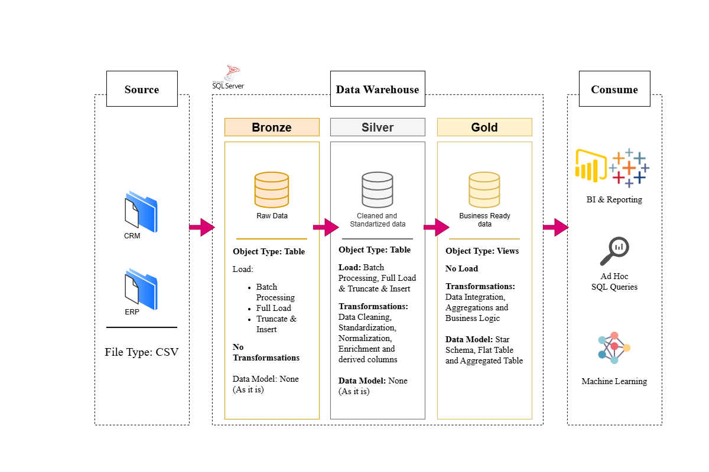

# SQL Data Warehouse Project

Building a modern data warehouse with SQL Server, following the **Medallion Architecture** (Bronze → Silver → Gold). This project consolidates sales data from two source systems — a CRM and an ERP — into a clean, analytics-ready layer using SQL-based ETL, then exposes it through a business-friendly star schema for reporting.

This is a portfolio project built to practice real-world data engineering and data warehousing concepts: data architecture design, ETL pipelines, data cleansing, dimensional modeling, and data quality validation.

---

## Data Architecture



The warehouse follows the **Medallion Architecture** across three layers:

1. **Bronze Layer** — Stores raw, unprocessed data exactly as it arrives from the source systems. Data is ingested from CSV files into SQL Server tables with no transformations applied.
2. **Silver Layer** — Cleanses, standardizes, and normalizes the bronze data: trimming whitespace, resolving inconsistent codes into readable values, deriving missing fields, handling invalid dates, and deduplicating records. This layer prepares the data for analysis.
3. **Gold Layer** — Business-ready data modeled into a **star schema** (fact and dimension tables) for reporting and analytics. This is the layer consumed by BI tools and analysts.

---

## Project Overview

This project involves:

1. **Data Architecture** — Designing a modern warehouse using the Bronze, Silver, and Gold layers.
2. **ETL Pipelines** — Extracting, transforming, and loading data from source CSVs into SQL Server using stored procedures.
3. **Data Modeling** — Building fact and dimension tables optimized for analytical queries.
4. **Data Quality Checks** — Validating referential integrity, deduplication, and standardization at each layer.

**Skills demonstrated:** SQL Development, Data Architecture, Data Engineering, ETL Pipeline Development, Data Modeling, Data Quality Assurance.

---

## Source Systems

| System | Description | Files |
|---|---|---|
| **CRM** | Customer relationship data | `cust_info.csv`, `prd_info.csv`, `sales_details.csv` |
| **ERP** | Enterprise resource data | `CUST_AZ12.csv`, `LOC_A101.csv`, `PX_CAT_G1V2.csv` |

---

## Repository Structure

```
sql-data-warehouse-project/
│
├── datasets/                          # Raw source CSV files (CRM & ERP)
│   ├── source_crm/
│   │   ├── cust_info.csv
│   │   ├── prd_info.csv
│   │   └── sales_details.csv
│   └── source_erp/
│       ├── CUST_AZ12.csv
│       ├── LOC_A101.csv
│       └── PX_CAT_G1V2.csv
│
├── docs/                              # Project documentation & diagrams
│   ├── Data_Architecture.png          # Overall medallion architecture diagram
│   ├── data_mart.png                  # Gold layer star schema diagram
│   ├── dataflow.png                   # End-to-end data flow diagram
│   ├── integration_model.png          # Source-to-target integration model
│   └── data_catalog.md                # Field-level catalog of gold layer tables
│
├── scripts/                           # SQL scripts for the ETL pipeline
│   ├── init_database.sql              # Creates the database and bronze/silver/gold schemas
│   ├── bronze/
│   │   ├── ddl_bronze.sql             # Table definitions for the bronze layer
│   │   └── strd_proc_load_bronze.sql  # Stored procedure to load raw CSVs into bronze
│   ├── silver/
│   │   ├── silver_ddl.sql             # Table definitions for the silver layer
│   │   └── strd_proc_load_silver.sql  # Stored procedure to cleanse & load bronze → silver
│   └── gold/
│       └── gold_ddl.sql               # Views defining the gold layer star schema
│
├── tests/                             # Data quality validation scripts
│   ├── silver_quality_checks.sql      # Checks run against the silver layer
│   └── gold_quality_checks.sql        # Checks run against the gold layer
│
└── README.md
```

---

## Gold Layer Data Model

The gold layer exposes three objects for reporting:

| Object | Type | Description |
|---|---|---|
| `gold.dim_customers` | Dimension | Customer details enriched with demographic and geographic data |
| `gold.dim_products` | Dimension | Active product records with category, subcategory, and pricing |
| `gold.fact_sale` | Fact | Order-line-level sales transactions, linked to both dimensions |

Full column-level definitions are in [`docs/data_catalog.md`](docs/data_catalog.md).

---

## How to Run

1. Run `scripts/init_database.sql` to create the `datawarehouse` database and the `bronze`, `silver`, and `gold` schemas.
2. Run `scripts/bronze/ddl_bronze.sql` to create the bronze tables, then execute `bronze.load_bronze` to load the raw CSVs from `datasets/`.
3. Run `scripts/silver/silver_ddl.sql` to create the silver tables, then execute `silver.load_silver` to cleanse and transform the bronze data.
4. Run `scripts/gold/gold_ddl.sql` to create the gold layer views.
5. Run the scripts in `tests/` to validate data quality at each layer.

> **Note:** File paths inside the `BULK INSERT` statements in `strd_proc_load_bronze.sql` are set for a local environment — update them to point to wherever you've cloned this repo's `datasets/source_crm/` and `datasets/source_erp/` folders on your own machine before running.

---

## Tools Used

- **SQL Server Express** & **SQL Server Management Studio (SSMS)** — database engine and query environment
- **Draw.io & Figma** — architecture and data flow diagrams
- **Git & GitHub** — version control and project hosting

---

## About This Project

This project was built as a hands-on learning exercise in data warehousing and data engineering, following the medallion architecture pattern used in production data platforms.

## Acknowledgments

This project was built by following the **[SQL Data Warehouse from Scratch](https://www.youtube.com/watch?v=9GVqKuTVANE)** tutorial by **Baraa Khatib Salkini ([Data With Baraa](https://www.youtube.com/@DataWithBaraa))**. The project structure, medallion architecture approach, and ETL/data modeling patterns follow his teaching — all credit for the course design and methodology goes to him. This repository is my own hands-on implementation, built for learning and portfolio purposes.
